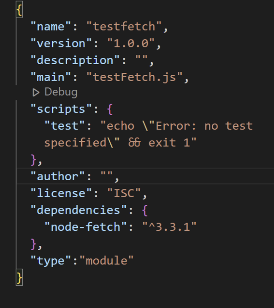

# 2. Installing packages and dependencies

## What is a Package?

A package in Node.js contains all the files you need for a module. And the modules are JavaScript libraries you can include in your project. If you are develop student or beginner developer, you should keep in mind that having the latest version of the package should be the first step you need to take.

## What is a Dependency?

It is a connection between two different modules. It is downloaded from installing `npm`, and `dependencies` and `devDependencies` are listed in the `package.json`.

## Why do I install

When you do your project, the very first step you should take is installing `package.json`.

The package.json file is a repository of descriptive and functional metadata pertaining to a project, including details like its name, version, and required dependencies. This information enables the `npm` package manager to efficiently manage the project's dependencies and accurately identify it.

Especially when you are working on a team project, you are better to have the latest version of `package.json`.
Running `npm install` will immediately install all the necessary dependencies dependencies for your project.

It is very important to do your project however it is very simple command to do it.

## Command

### 1. First, run the following command:

```
npm init
```

If you run this command, it will ask you some questions and you answer them to move on to the next command.

### 2. Then, run the following command:

```
npm install
```

Once you have finished those commands, you should have package.json and `node_modules` installed. Then, open the `package.json` and add a line `"type: module"` like the following:

{ align=left }

## Conclusion
In order to utilize the Fetch API in your project, make sure your Node.js version is current. Use 'node -v' to see your current version. Update Node.js to the most recent stable version ('npm i node@latest') or the most recent LTS version ('npm i node@lts') if it is below v18.0.0.

Once Node.js has been upgraded, you can utilize the Fetch API without encountering compatibility problems, allowing for excellent data management and efficient network queries in your Node.js apps.


